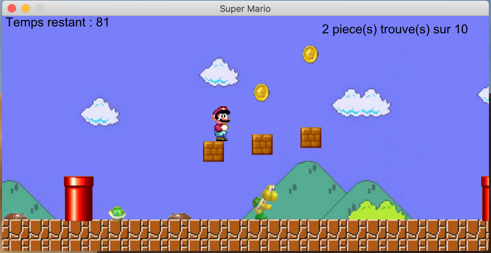

= SUPER MARIO MICHAEL VERSION

This game was developed in Java with the IDE Eclipce.

== Important ! 
This project was carried out with the aim of developing my java skills. The names of my functions and my variables are unfortunately always in French. The English version will be available shortly. Thank you for your understanding.

== How to play ? 

	JUMP  : press Space;
	RIGHT : right key;
	LEFT  : left key;

* You must collect all the pieces to complete the game . +
* There is often very loud background music. Reduce the volume on your device before launching the game.
 
== How to run the application?

* In the IDE: find `Main.java`, right-click project, select "Run As > Java Application"
* From the command line: run `java -jar hangman.jar`
* Make sure that the "files" folder containing the dictionary files is in the main directory (in case you have used the command line)

